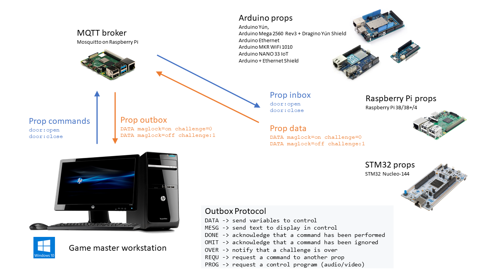

# ArduinoProps2 library

## Introduction

This library was originally created by Faure Systems to work with xcape.io. Because of deprecation, this library was picked up again and updated to work with IoT stuff during the course Web Of Things at Arteveldehogeschool.

## Contents

1. [Installation and usage](#1-installation-and-usage)
2. [Escape room 2.0 prop with Arduino](#2-escape-room-20-prop-with-arduino)
3. [*ArduinoProps library* value for escape room 2.0](#3-arduinoprops-library-value-for-escape-room-20)
4. [Application protocol for escape room 2.0 prop](#4-application-protocol-for-escape-room-20-prop)
5. [Compatible hardware](#5-compatible-hardware)
6. [Advantages of Arduino Yún and Dragino Yún shield](#6-advantages-of-arduino-Yún-and-dragino-Yún-shield)
7. [Advantages of the *ArduinoProps library*](#7-advantages-of-the-arduinoprops-library)
8. [Limitations due to *PubSubClient*](#8-limitations-due-to-pubsubclient)
9. [Examples](#9-examples)

|ArduinoProps library documentation                           |
|-------------------------------------------------------------|
| [This README file](README.md)                               |
| [Introduction to Arduino Props](help/Arduino_Props.md)      |
| [Arduino Prop sketch](help/ArduinoProp_sketch.md)           |
| [`Prop` class reference](help/Prop.md)                      |
| [`PropData` class reference](help/PropData.md)              |
| [`PropAction` class reference](help/PropAction.md)          |
| [ArduinoProps library examples](EXAMPLES.md)                |
| [WiFiNINA firmware update](help/WifiNinaFirmware.md)        |


## 1. Installation and usage
### Prepare Arduino IDE
Download [ArduinoProps2.zip](https://github.com/gdm-webofthings/ArduinoProps2/raw/master/ArduinoProps2.zip) from GitHub and use **Sketch > Include Library > Add .ZIP Library...**


Download library dependencies for Library Manager:
* ***PubSubClient***
* ***ListLib***


### Start coding your own prop
Add `#include "ArduinoProps.h"` on top of your sketch and start coding.

A fork of one the examples is the fastest way to create your own prop.

### Find help in the documentation

Reading [EXAMPLES.md](EXAMPLES.md) will be helpful.


## 2. Escape room 2.0 prop with Arduino

The *ArduinoProps library* allows to build *escape room 2.0 prop* easily with Arduino.

The *ArduinoProps library* relies on *<a href="https://github.com/knolleary/pubsubclient" target="_blank">Nick O'Leary PubSubClient</a>* library for MQTT. MQTT is a lightweight

 publish/subscribe messaging protocol designed for M2M (machine to machine) telemetry in low bandwidth environments.


## 3. *ArduinoProps library* value for escape room 2.0
*Nick O'Leary PubSubClient* library is sufficient to write escape room 2.0 prop Arduino code.

The *ArduinoProps library* relies on *Nick O'Leary PubSubClient* for MQTT messaging and provides a framework and protocol for helping and accelerating the coding of Arduino prop. If you will help build simple and complex prop with reliable code.

Since 2016, *ArduinoProps library* is used extensively in many escape rooms with up to 20 prop per room (which is no limit at all), with a high level of availability and sustainability.

### Inbox/oubox messaging
Instead of usual MQTT topic structure which sends every data value in a different topic for every variable, *ArduinoProps library* sends data via a unique outbox topic.

Prop receives commands in its inbox MQTT topic.

Prop can subscribe to any other MQTT topic to receive othe information, for example the escape game scenario (English/French/Kids) or the game clock countdown.

#### Escape room structured MQTT topics
If you're running our Escape Room control software *Room 2.0* to supervise the escape room in real-time you have to respect its syntax for inbox/outbnox MQTT topics:
```csharp
Room/[escape room name]/Props/[props name]/inbox|outbox

example:
    Room/Demoniak/Props/Arduino Contrôleur/inbox
    Room/Demoniak/Props/Arduino Contrôleur/outbox
```
MQTT supports UTF-8 encoding.

### Sending messages only when appropriate
Usually Arduino IoT sketches send MQTT data for every variable at every loop. When the loop is fast, you can get tons of useless messages, and usually a sleeping delay is added at every loop to slow down the message flow ; this can slow down significantly the prop response time to human supervision and automation commands.

While Arduino sketch is sending a message it isn't doing prop sensor/actuator processing, and it takes about 20 to 40 milliseconds to send a message. With too many messsages it's too much processing time wasted.

*ArduinoProps library* sends all data periodically every 30 seconds (default parameter) and sends data changes over a period of time you choose (typical 400 milliseconds for real-time behavior, but you may choose every 100 milliseconds, 1 or 3 seconds: your choice for your application).

Therefore the minimum processing time is used to send messages.

Tracking data changes could make Arduino code difficult to read and maintain but the. *ArduinoProps library* will hide this mechanism and make the code much more readable.

Some analog data can change at every loop but not significantly, for example U=2.77 volts while showing this when it changes more than 10% could be sufficient. *ArduinoProps library* offers a nice syntax to take care of this significance, with simple code.

### Maintaining MQTT server connection
MQTT connection state must be checked at erevy sketch loop as well as incoming MQTT messages. *ArduinoProps library* does all in one code line.

And on Yún this same code line can switch MQTT server IP address (can be helpful in a fallback plan).

### Simple human-readable text protocol
An escape room 2.0 is typically centrally controlled from a Windows PC which provides the Game Master with monitoring and control information as well as some automation.

To unifiy escape room 2.0 development, *ArduinoProps library* provides a simple [protocol](https://github.com/xcape-io/PyProps/blob/master/PROTOCOL.md) between prop and room controller at application level:
```csharp
    DATA -> send variables to control
    MESG -> send text to display in control
    DONE -> acknowledge that a command has been performed
    OMIT -> acknowledge that a command has been ignored
    OVER -> notify that a challenge is over
    REQU -> request a command to another prop
    PROG -> request a control program
```



### Handling long message seamlessly and efficiently
MQTT standard limitations are far above what we need:
- maximum topic length 65,536 bytes (64k)
- maximum message size 268,435,456 bytes (256M)

However, on Arduino the limit is for the addition of topic length + message length:
- Wifi shield limit is 80 bytes

DATA messages when many I/O like on Arduino Mega 2560 and MESG information messages can go very long, and crash the sketch without notice at run-time.

*ArduinoProps library* seamlessly splits long messages smartly when required.

## 4. Application protocol for escape room 2.0 prop

A *level 7* [protocol](https://github.com/xcape-io/PyProps/blob/master/PROTOCOL.md) (*application level*) is necessary for connected prop to report data and to be controlled for the escape room automation and game play.

We have defined a simple human-readable text protocol. Messages are encoded in UTF-8, in Arduino sketches use:
```csharp
    str = u8"la chaîne avec des caractères non Latin1";
```

Messages are sent/received thru outbox/inbox MQTT topics:
```csharp
    Room/[escape room name]/Props/[props name]/inbox
    Room/[escape room name]/Props/[props name]/outbox
```

Prop connection state is handled in the outbox topic:
* with a `DISCONNECTED` **Will** when MQTT server connection is broken
* with a `CONNECTED` **retained message** when MQTT server connection is established.

More MQTT topics can be use for anything (room scenario, etc.).

#### Messages sent from the Arduino prop are formatted
```csharp
    DATA sensor=24.26 light=on challenge=pinball
    MESG Warning: sensor not detected
    DONE power:1
    OMIT power:1
    OVER pinball
    REQU Arduino Relay -> door:open
    PROG audio-final:start
```

#### Message received by the Arduino prop have no particular format
```csharp
    power:1                  for example to power on the room
    porte-salon:ouvrir       for example to open a door
    lumière-salon:éteindre   for example to switch-off a light
```


#### @PING-PONG special messages
```csharp
    @PING is received in inbox then the prop sends just PONG in outbox
    -> so the escape room controller can monitor response time at application level
```


## 5. Compatible hardware
For WiFi prop, please update the WiFiNINA firmware: [WiFiNINA firmware update](help/WifiNinaFirmware.md).

## 7. Advantages of the *ArduinoProps library*
You can build escape room 2.0 Arduino-based prop just with Nick O'Leary PubSubClient library for MQTT.

With *ArduinoProps library*:
- create connected prop quickly thanks to the application protocol and examples
- targetted for escape room prop, *ArduinoProps library* can be used for any IoT project
- re-use your code when creating new escape rooms
- rely on *ArduinoProps library* robustness: for example, ***the library handles the Arduino Yún Bridge transfer size limitation by smartly splitting large messages (only) when necessary***.

**Note:** sending too large messages to Arduino Bridge breaks the Arduino sketch. *ArduinoProps library* prevents this crash case.

*ArduinoProps library* itself relies on *Nick O'Leary PubSubClient* library for MQTT.


## 8. Limitations due to *PubSubClient*
These limitations are not an issue for escape room prop:
 - It can only publish QoS 0 messages.
 - It can subscribe at QoS 0 or QoS 1.
 - The keepalive interval is set to 15 seconds by default. This is configurable
   via `MQTT_KEEPALIVE` in `PubSubClient.h`.
 - The client uses MQTT 3.1.1 by default. It can be changed to use MQTT 3.1 by
   changing value of `MQTT_VERSION` in `PubSubClient.h`.


## 9. Examples

The library comes with a number of example sketches. See **File > Examples > ArduinoProps** within the Arduino IDE application.

See [EXAMPLES.md](EXAMPLES.md) for an adaptation of the Blink example (https://www.arduino.cc/en/tutorial/blink) as a simple MQTT prop:

**BlinkOnWifiProp**: the Blink example on a Wifi prop with *ArduinoProps library*

## Author

**Tim De Paepe**
* company: Arteveldehogeschool
* mail: tim.depaepe@arteveldehs.be

**Faure Systems**
* company: FAURE SYSTEMS SAS
* web: <a href="https://faure.systems/" target="_blank">Faure Systems</a>