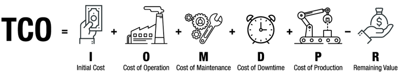

# Introduction to Arduino Props

* [Arduino Props for Escape Room 2.0](#arduino-props-for-escape-room-20)
* [Escape room 2.0 constraints on prop](#escape-room-20-constraints-on-prop)
* [ArduinoProps library for escape room 2.0](#arduinoprops-library-for-escape-room-20)
* [Arduino Ethernet and Wifi](#arduino-ethernet-and-wifi)
* [WiFi Firmware](#wifi-firmware)

## Arduino Props for Escape Room 2.0

The *ArduinoProps library* for Arduino has been designed to build *escape room 2.0 prop*.

Specificities of prop for escape rooms:
- very high uptime (near 100%)
- fast problem fixing
- real-time (human scale) notification and control
- fallback controls
- low Total Cost of Ownership

Benefits and specificities of the *ArduinoProps library*
- rely on standard MQTT messaging protocol for IoT
- simplify and ease Arduino coding
- constant sustaining of Arduino code (YUN)
- real-time notification, monitoring and control (human scale)

## Escape room 2.0 constraints on prop
Escape game are opened 7 days a week and particularly booked during weekends and usually until midnight. Therefore their uptime must be close to 100% and incidents must be worked-around immediately by the game master (manual commands).

Escape Room Props operation and performance impact directly escape game customer experience. Therefore notifications must be processed in human-scale real-time, automatically or manually by a non-technological user (the game master).

Escape Room Props TCO (Total Cost of Ownership) must be affordable by escape games (SOHO costs for small businesses), processing is usually supported by Arduino or Raspberry boards.

IT professional 24/7 support must be avoided for cost reasons. Therefore prop code must be the most reliable.

## *ArduinoProps library* for escape room 2.0
[MQTT](http://mqtt.org/) is a machine-to-machine (M2M)/"Internet of Things" connectivity protocol. It was designed as an extremely lightweight publish/subscribe messaging transport.

*ArduinoProps library* relies on *[Nick O'Leary PubSubClient](https://github.com/knolleary/pubsubclient)*, a simple publish/subscribe messaging Arduino library. [PubSubClient](https://github.com/knolleary/pubsubclient) is a MQTT client with a few limitations:

- It can only publish QoS 0 messages. It can subscribe at QoS 0 or QoS 1.
- The maximum message size, including header, is 128 bytes by default. This is configurable via MQTT_MAX_PACKET_SIZE in PubSubClient.h.
- The keepalive interval is set to 15 seconds by default. This is configurable via MQTT_KEEPALIVE in PubSubClient.h.
- The client uses MQTT 3.1.1 by default. It can be changed to use MQTT 3.1 by changing value of MQTT_VERSION in PubSubClient.h.

How does *ArduinoProps library* use MQTT efficiently in escape rooms:

- Every prop has two MQTT topics assigned as inbox and outbox.
- More MQTT topics can be used to share game countdown, scenario or any common useful dynamic data for the escape game.
- Notifying the prop is done by publishing a message on its inbox topic.
- Other prop or software controllers can subscribe to the prop outbox topic to receive all its notifications.
- *ArduinoProps library* includes a ping process at application level, in LAN network the round-trip-delay is around 50 milliseconds.
- *ArduinoProps library* is defaulted to publish QoS 0 messages and to subscribe at QoS 1.

*ArduinoProps library* wraps [PubSubClient](https://github.com/knolleary/pubsubclient) to make Arduino code the most simple and readable for better sustainability.

## Arduino Ethernet and Wifi
Arduino with Ethernet or Wifi shield is suitable to build an Escape Room Props, however the sketch must be uploaded with an USB cable, so it is not convenient for prop design and worse for prop in production, which can lead to an unexpected significant increase in TCO.

> Ethernet and WiFi shield are connected to Arduino with SPI port.

## WiFi Firmware
For WiFi prop, please update the WiFiNINA firmware: [WiFiNINA firmware update](WifiNinaFirmware.md).

## Author

**Faure Systems**
* company: FAURE SYSTEMS SAS
* web: <a href="https://faure.systems/" target="_blank">Faure Systems</a>